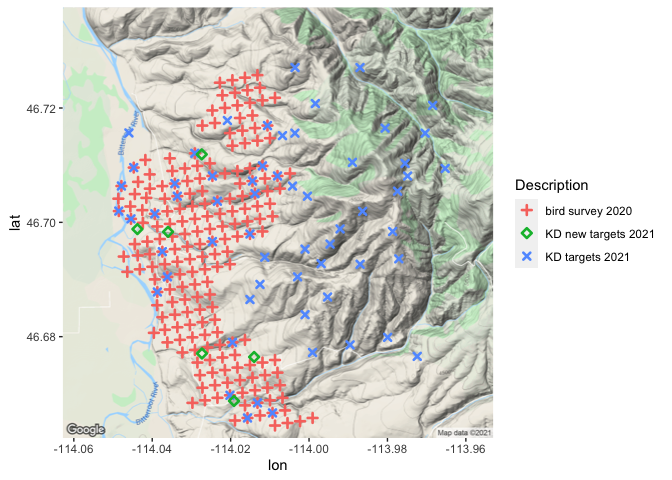

Choosing survey locations for 2021 at MPG Ranch
================
Beau Larkin
2021-03-25

# Description

In 2021, Kyle Doherty used a clustering procedure to choose 63 locations
for surveys. 60 are from the original set of grid points at MPG Ranch.
We also had \~200 points surveyed for birds in 2020. Here, the purpose
is to create an output file that can be fed through a pipeline to
produce a KML for viewing the selected points in Google Earth. Others at
MPG will view the points so we can discuss where surveys should occur.

## Output detail

The spreadsheet data will be uploaded to Earth Point’s [Excel To
KML](https://www.earthpoint.us/exceltokml.aspx) tool for transposition.
For the tool, the exported data frame must have at minimum the columns:
Latitude, Longitude, Name, Description, and Icon. The column for Folder
will also be added.

# Package and library installation

``` r
packages_needed = c("tidyverse", "rjson", "bigrquery", "ggmap")
packages_installed = packages_needed %in% rownames(installed.packages())
if (any(!packages_installed))
    install.packages(packages_needed[!packages_installed])
for (i in 1:length(packages_needed)) {
    library(packages_needed[i], character.only = T)
}
```

    ## ── Attaching packages ─────────────────────────────────────── tidyverse 1.3.0 ──

    ## ✓ ggplot2 3.3.3     ✓ purrr   0.3.4
    ## ✓ tibble  3.1.0     ✓ dplyr   1.0.5
    ## ✓ tidyr   1.1.3     ✓ stringr 1.4.0
    ## ✓ readr   1.4.0     ✓ forcats 0.5.0

    ## ── Conflicts ────────────────────────────────────────── tidyverse_conflicts() ──
    ## x dplyr::filter() masks stats::filter()
    ## x dplyr::lag()    masks stats::lag()

    ## Google's Terms of Service: https://cloud.google.com/maps-platform/terms/.

    ## Please cite ggmap if you use it! See citation("ggmap") for details.

## API keys

All keys installed from local resources

``` r
# Big Query
bq_auth(
    path = paste0(getwd(), "/mpg-data-warehouse-api_key-master.json"),
    cache = NULL
)
Sys.setenv(BIGQUERY_TEST_PROJECT = "mpg-data-warehouse")
billing <- bq_test_project()

# Google maps
mapKey <-
    fromJSON(file = paste0(getwd(), "/R_globalKeys.json"))$mapKey
register_google(key = mapKey)
```

## Styles and functions

``` r
# Global themes and styles
source(paste0(getwd(), "/supplemental.R"))
```

Pull data from source

``` r
# Grid point metadata
gp_meta_sql <-
    "
  SELECT grid_point, lat, long
  FROM `mpg-data-warehouse.grid_point_summaries.location_position_classification`
  "
gp_meta_bq <- bq_project_query(billing, gp_meta_sql)
gp_meta_tb <- bq_table_download(gp_meta_bq)
gp_meta_df <- as.data.frame(gp_meta_tb) %>%
    rename(Latitude = "lat", Longitude = "long")

# Bird survey points from 2020
bird_2020_sql <-
    "
    SELECT DISTINCT survey_year, survey_grid_point
    FROM `mpg-data-warehouse.bird_point_count_summaries.abundance_order`
    WHERE survey_year = 2020
    ORDER BY survey_grid_point
    "
bird_2020_bq <- bq_project_query(billing, bird_2020_sql)
bird_2020_tb <- bq_table_download(bird_2020_bq)
bird_2020_df <- as.data.frame(bird_2020_tb) %>%
    rename(Name = "survey_grid_point") %>%
    select(-survey_year)

# KD proposed survey points
# Old points
kd_pts <-
    read.csv(paste0(getwd(), "/2021_gp_targets.csv"),
             sep = ",",
             header = TRUE) %>%
    rename(Name = "kd_targets_2021")
# New points
kd_pts_new <-
    read.csv(paste0(getwd(), "/2021_gp_targets_new.csv"),
             sep = ",",
             header = TRUE) %>%
    rename(Name = "grid_point",
           Latitude = "lat",
           Longitude = "long")
```

Produce location data table Remove the three new points from KD’s set
because we don’t have location metadata for them and may not sample them
in the future…

``` r
locs <- rbind(
    bird_2020_df %>%
        left_join(gp_meta_df, by = c("Name" = "grid_point")) %>%
        select(starts_with("L"), Name) %>%
        mutate(
            Description = "bird survey 2020",
            Icon = 201,
            IconColor = "Yellow",
            Folder = "Survey planning 2021/bird survey pts 2020"
        ),
    kd_pts %>%
        left_join(gp_meta_df, by = c("Name" = "grid_point")) %>%
        select(starts_with("L"), Name) %>%
        mutate(
            Description = "KD targets 2021",
            Icon = 202,
            IconColor = "Cyan",
            Folder = "Survey planning 2021/Kyle Doherty pts 2021"
        ) %>%
        drop_na(),
    kd_pts_new %>%
        select(starts_with("L"), Name) %>%
        mutate(
            Description = "KD new targets 2021",
            Icon = 203,
            IconColor = "Lime",
            Folder = "Survey planning 2021/Kyle Doherty new pts 2021"
        )
) %>% 
    mutate(HideNameUntilMouseOver = "True")
```

View locations

``` r
mpgr_map <-
    ggmap(get_googlemap(
        center = c(lon = -114.008, lat = 46.700006),
        zoom = 13,
        scale = 2,
        maptype = 'terrain'
    ))
```

    ## Source : https://maps.googleapis.com/maps/api/staticmap?center=46.700006,-114.008&zoom=13&size=640x640&scale=2&maptype=terrain&key=xxx-4x-49Z5StPBSu3RyhshUzk4

``` r
mpgr_map +
    geom_point(
        data = locs,
        aes(
            x = Longitude,
            y = Latitude,
            shape = Description,
            color = Description
        ),
        stroke = 1.4
    ) +
    scale_shape_manual(values = c(3, 5, 4))
```

<!-- -->
